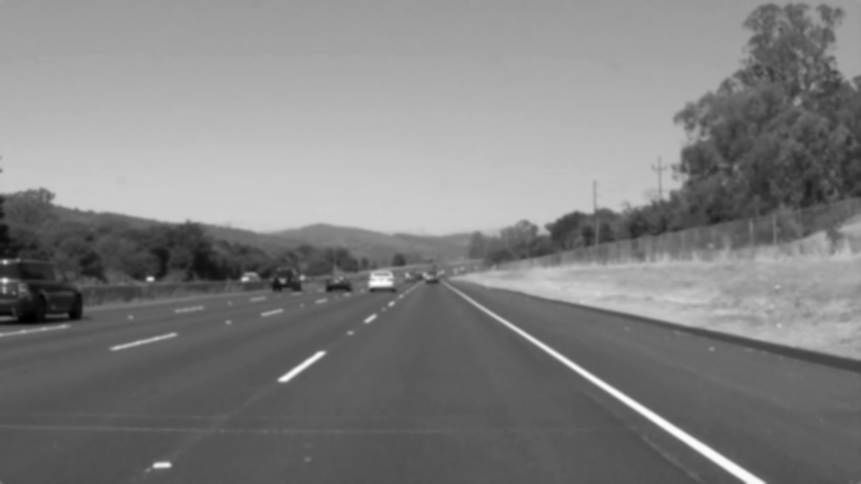
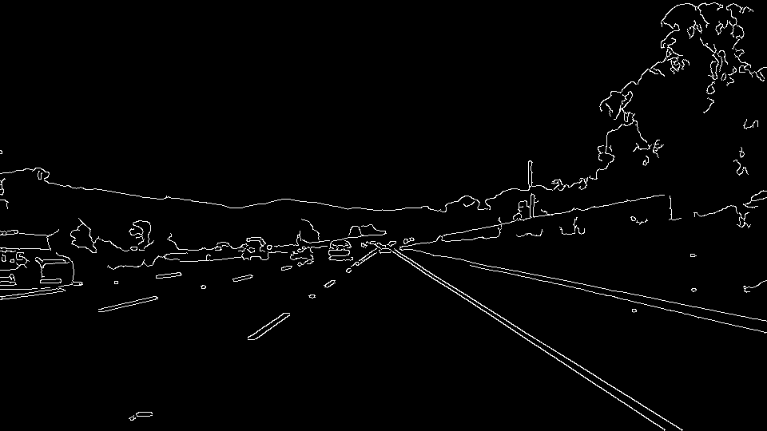
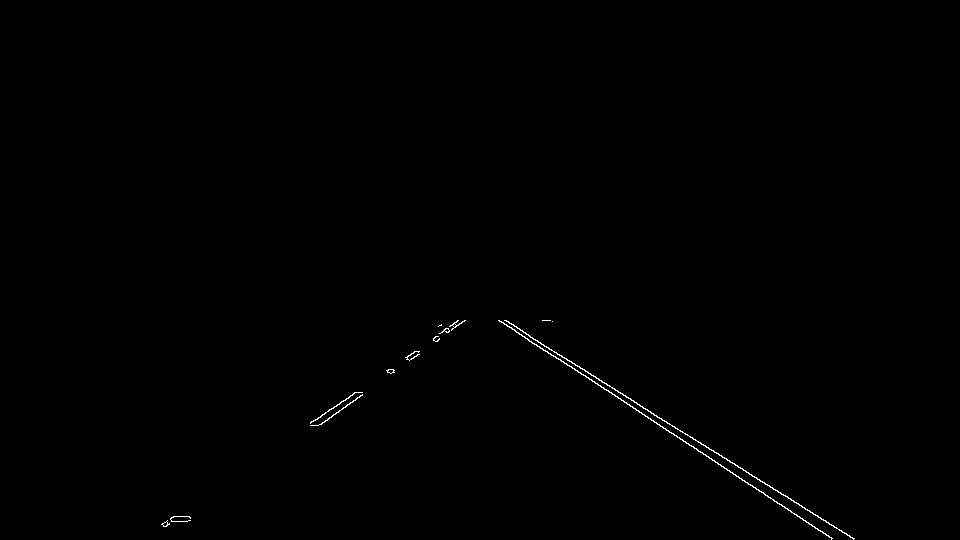
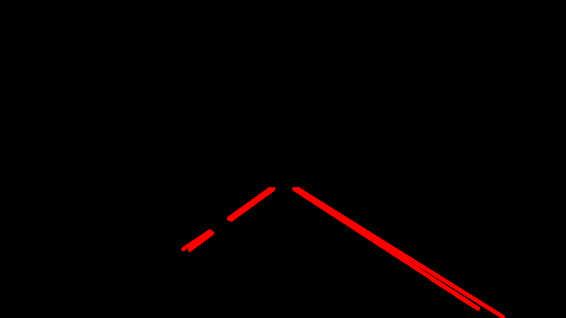
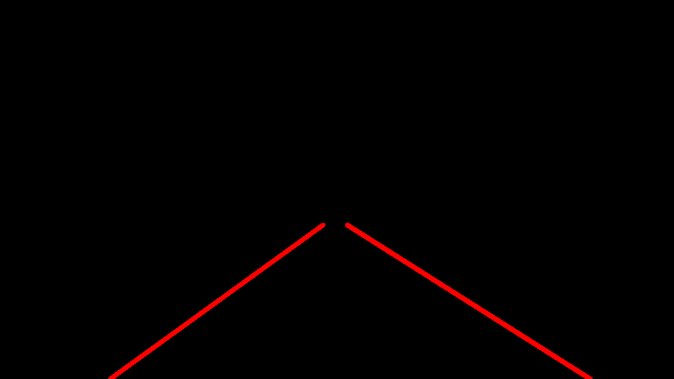
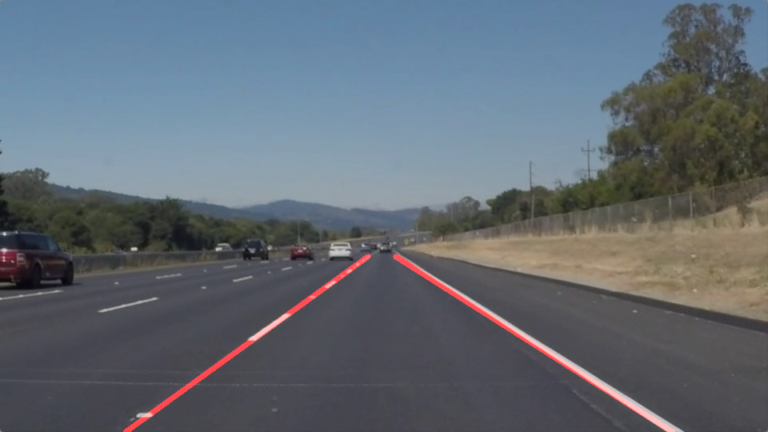

# **Finding Lane Lines on the Road** 

### Reflection

### 1. Describe your pipeline. As part of the description, explain how you modified the draw_lines() function.

My pipeline consistS of 7 steps. 

---
**Step 1: Converting the original image into a grayscale** 

---
**Step 2: Blurring the grayscale image using cv2.GaussianBlur** 

---
**Step 3: Detecting edges by applying Canny Edge detection**

---
**Step 4: Masking the edge image to obtain an image only with lines in the region of interest**

---
**Step 5: Detecting which edges are part of a lane line by applying a Hough transformation**

---
**Step 6: Connecting the single lines out of the Hough transformation and extrapolating the lines within the function draw_lines()**

--
Step 6.1: Dividing the single lines into lines that are part of the left and right lane line 

--
Step 6.2: Calculating the average position and slope of the left and right lines.  

---
**Step 7: Insert the detected lane lines into the original image**

### 2. Potential shortcomings 

One potential shortcoming would be what would happen when the contrast between the lane line and the street is not high enough. In this case edges cannot be detected properly. 

Another potential shortcoming would be what would happen when the street gets curvier. In this case the extrapolated lane lines wouldn't represent the lane lines accurate enough.

### 3. Possible improvements 

A possible improvement would be to define the parameters for the Canny Edge detection dynamically to ensure the detection of lane lines on a street where the color contrast between the street and the lane line is not high.
